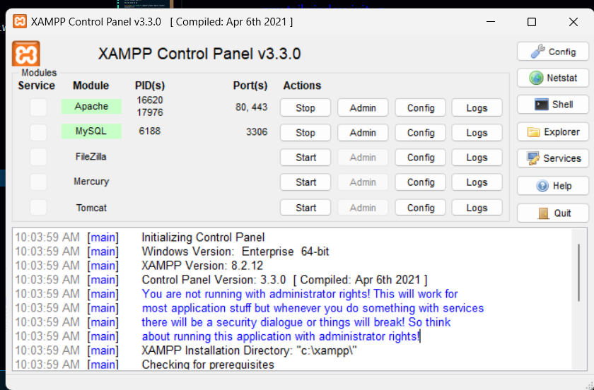

## About Laravel

Laravel is a web application framework with expressive, elegant syntax. We believe development must be an enjoyable and creative experience to be truly fulfilling. Laravel takes the pain out of development by easing common tasks used in many web projects, such as:

-   [Simple, fast routing engine](https://laravel.com/docs/routing).
-   [Powerful dependency injection container](https://laravel.com/docs/container).
-   Multiple back-ends for [session](https://laravel.com/docs/session) and [cache](https://laravel.com/docs/cache) storage.
-   Expressive, intuitive [database ORM](https://laravel.com/docs/eloquent).
-   Database agnostic [schema migrations](https://laravel.com/docs/migrations).
-   [Robust background job processing](https://laravel.com/docs/queues).
-   [Real-time event broadcasting](https://laravel.com/docs/broadcasting).

Laravel is accessible, powerful, and provides tools required for large, robust applications.Laravel required the one backend server and one db server.

## Work Flow

1.  Install The xampp for php server and Mysql server
     
    How to download ?
     

    -   [Go to the site ](https://www.apachefriends.org/download.html)

    -   Download xampp on the basis of your os.

    -   Install xampp by clicking the next next

        

    -   Config the apache server that is remove the semicloumn in .zip, .intl, .gd

2.  Install the composer .composer is used to install the pacakaged like npm pip

    -   [Go to the site ](https://getcomposer.org/download/)

    -   Install it

    

3.  Install the project
    [link to intalize the project](https://laravel.com/docs/11.x/installation)

    <h4 style="color:blue;">composer create-project laravel/laravel example-app</h4>

    You can also do by

    <h4 style="color:blue;"> composer global require laravel/installer</h4>

    <h4 style="color:blue">laravel new example-app <h2/>

    <h4 style="color:blue"> where example-app is the projectName </h4

4.  Install the tailwind css

    <h4 style="color:blue">npm install -D tailwindcss postcss autoprefixer<h2/>

    <h4 style="color:blue">npx tailwindcss init -p <h2/>

    <h4 style="color:blue;"> @type {import('tailwindcss').Config}

    export default {
    content: [
    "./resources/**/*.blade.php",
    "./resources/**/*.js",
    "./resources/**/*.vue",
    ],
    theme: {
    extend: {},
    },
    plugins: [],
    }

    </h4>

    <h4 style="color:blue">npm run build</4>

5.  Run The project

    <h4 style="color:blue">php artisan serve</h4>

6.  Tables

    <table border="1">
        <thead>
            <tr>
                <th>Installed</th>
                <th>Purpose</th>
            </tr>
        </thead>
        <tbody>
            <tr>
                <td>Xampp</td>
                <td>for php server and mysql server</td>
            </tr>
            <tr>
                <td>Composer</td>
                <td>for package installation</td>
            </tr>
        </tbody>

    </table>

## Larvel also based on MVC Design Pattern so, Laravel fulll stack Framework.

    1. M= Model stand for model . It represent the database structure.

    2. v = views means the page the user sees.

    3. c = controllers means business Logic.

## Second Day

    passing data from Route to certain Page (views)

    compact keyword is used to pass the data from route to    certain Page

   <h4> When user hit "/about/anything" then about page will be provided to anything </h4>

    Getting the data

## To implement the resuablity of same component

    php artisan make:component componentName

    This command will make components inside the app and resource folder .

    call whenever the this compnent is required

# Point ro Remember

Make sure you use <x-front-end-navbar/> dashed before component name while calling
